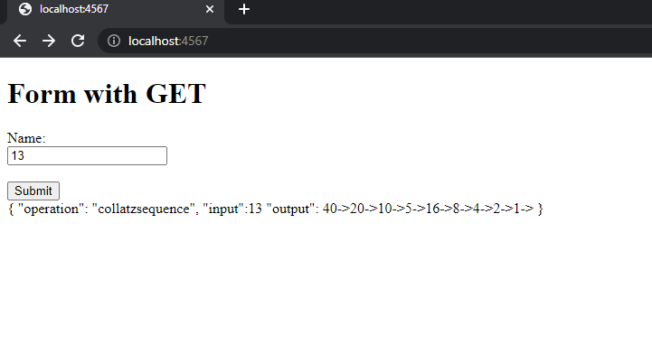

ENUNCIADO

Diseñé, construya y despliegue un aplicación web para investigar la conjetura de Collatz. El programa debe estar desplegado en un microcontenedor Docker corriendo en AWS. LAs tecnologías usadas en la solución deben ser maven, git, github, maven, sparkjava, html5, y js. No use liberías adicionales.

NO COPIE CÓDIGO EXISTENTE NI SUYO NI DE OTRAS FUENTES. TODO EL ENTREGABLE DEBE SER ORIGINAL CREADO EN LA CLASE POR USTED.

Solo use la documentación autorizada por el profesor.

DOCUMENTACIÓN AUTORIZADA:
https://docs.oracle.com/javase/8/docs/api/
https://sparkjava.com/
Enunciado de Taller de Docker
Enunciado de Taller de intro a Spark
AWS Academy
AWS

PROBLEMA:
La conjetura de Collatz dice que si usted crea una secuencia de números, a partir de cualquier entero positivo, siguiendo las reglas descritas abajo, siempre la secuencia terminará en le número 1. Esta conjetura aún no se ha demostrado.

Las reglas son:
f(n)=n/2
si n es par.
f(n)=3n+1
si n es impar.
La secuencia se construye a partir de un número dado k
así:
a0=k
ai=f(ai−1)
Por ejemplo, dato el número k=13
la secuencia sería:

13→40→20→10→5→16→8→4→2→1

ARQUITECTURA:
Construya una aplicación web para investigar este problema. La aplicación debe tener esta arquitectura:
Cliente asíncrono que corra en el Browser escrito en en HTML5 y JS (No use librerías, solo html JS básico). El cliente recibe un número y muestra la secuencia de Collatz generada a partir de ese número.
El cliente NO COMPUTA LA SECUENCIA DIRECTAMENTE, sino que la delega a un serviucio REST corrieno en AWS.
Servicio REST para construcción de la secuencia de Collatz, el servicio puede ser GET o POST. El servicio recibe el número inicial en la variable del query con nombre "value".
Ejemplo de una llamado:

http://amazonxxx.x.xxx.x.xxx:{port}/collatzsequence?value=13

Salida. El formato de la salida y la respuesta debe ser un JSON con el siguiente formato

{

"operation": "collatzsequence",

"input":  13,

"output":  "13 -> 40 -> 20 -> 10 -> 5 -> 16 -> 8 -> 4 -> 2 -> 1"

}

Se debe construir la aplicación usando SparkJava y desplegarla en un contenedor docker corriendo en AWS.
Cree un solo repositorio en github para toda la aplicación
Use los mejores estándares de diseño, arquitectura y programación.
ENTREGABLE:

1. Proyecto actualizado en github. Incluya instrucciones de cómo clonarlo, compilarlo, y deplegarlo.
 1.1 para clonar el repositoriio usar en su consola CMD : git clone https://github.com/liontama2121/arep-parcial2
 1.2 para compilar  mvn clean install
 1.3 mvn pakage clean intall
 1.3 pruebas de funcionamiento
 
 
 
2. pruebas AWS funcionaminto
  
  

